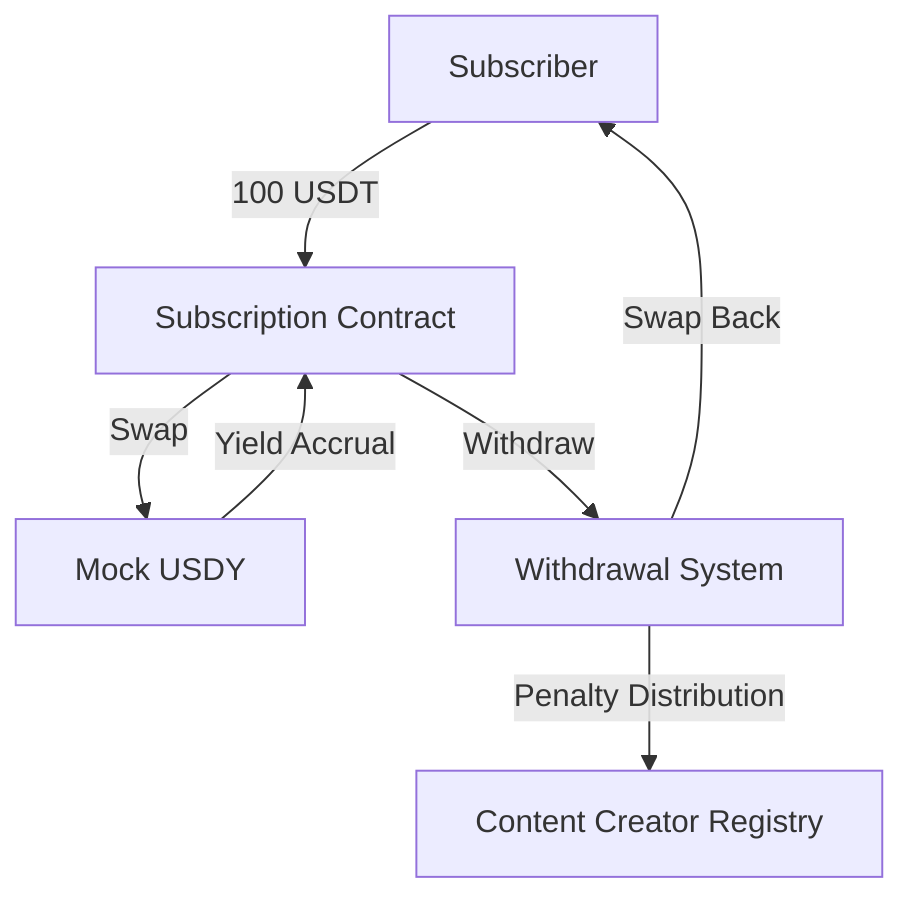

# Lossless Subscription Platform - Smart Contract Architecture

## Overview

The Lossless Subscription Platform enables content creators to earn from USDY yield while subscribers get their principal back. The platform consists of multiple interconnected smart contracts that handle token mechanics, subscriptions, and withdrawal logic.

## Core Components

### 1. Mock USDT Token (MockUSDT.sol)
- **Purpose**: Simulates USDT token for testing and development
- **Standard**: ERC20
- **Features**:
  - Mint/Burn functionality for testing
  - Standard ERC20 methods
  - decimals: 18

### 2. Mock USDY Token (MockUSDY.sol)
- **Purpose**: Simulates USDY token with yield mechanics
- **Standard**: ERC20
- **Features**:
  - Monthly yield accrual at ~0.416% (5% APY)
  - Fixed monthly growth calculation
  - Simulates real-world USDY behavior

### 3. Content Creator Registry (ContentCreatorRegistry.sol)
- **Purpose**: Manages content creator registration and updates
- **Features**:
  - Self-registration with wallet + username
  - Fully updatable (wallet and username can be changed anytime)
  - Stores creator information
  - Tracks creator earnings

### 4. Subscription Contract (Subscription.sol)
- **Purpose**: Main contract handling subscriptions
- **Features**:
  - Fixed subscription: 100 USDT per content creator
  - USDT → USDY swap on subscription
  - Multiple subscriptions allowed (100 USDT per content creator)
  - No maximum lock period
  - Monthly yield accrual tracking

### 5. Withdrawal System
- **Purpose**: Handles different withdrawal scenarios
- **Features**:
  1. **Immediate Withdrawal**: Pay 1 USDT penalty → Get ~99 USDT back
  2. **Early Withdrawal (< 30 days)**: Pay 0.5 USDT penalty → Get ~99.5 USDT back after 30 days
  3. **Complete Epoch (1 month)**: No penalty → Get 100 USDT back + accrued yield
  - USDY → USDT swap on withdrawal
  - Penalty distribution to content creators

## Token Flow

```
USDT Lock → USDY Swap → Yield Accrues (monthly) → USDY→USDT Swap → Withdrawal
```

## Key Mechanics

### Yield Calculation
- **APY**: 5%
- **Monthly Rate**: ~0.416% (fixed monthly growth)
- **Accrual**: Monthly compounding

### Subscription Process
1. Subscriber sends 100 USDT
2. USDT swapped to USDY
3. USDY deposited in yield-generating mechanism
4. Monthly yield accrues to the subscription balance

### Withdrawal Options

#### Option 1: Immediate Withdrawal
- **Penalty**: 1 USDT
- **Return**: ~99 USDT
- **Process**: Instant

#### Option 2: Early Withdrawal (< 30 days)
- **Penalty**: 0.5 USDT
- **Return**: ~99.5 USDT
- **Delay**: 30 days

#### Option 3: Complete Epoch (1 month)
- **Penalty**: None
- **Return**: 100 USDT + accrued yield
- **Delay**: 1 month

## Contract Interactions



## Security Considerations

1. **Reentrancy Protection**: Use ReentrancyGuard
2. **Access Control**: OnlyOwner for critical functions
3. **Input Validation**: Validate all inputs
4. **Penalty Distribution**: Ensure penalties are distributed correctly
5. **Yield Calculation**: Prevent manipulation of yield calculations

## Testing Strategy

1. **Unit Tests**: Test individual contract functions
2. **Integration Tests**: Test contract interactions
3. **Scenario Tests**: Test complete user journeys
4. **Edge Cases**: Test boundary conditions
5. **Security Tests**: Test for common vulnerabilities

## Deployment

- **Local Development**: Foundry/Anvil
- **Testnet**: Sepolia/Goerli
- **Mainnet**: Ethereum
- **Verification**: Verify contracts on Etherscan
